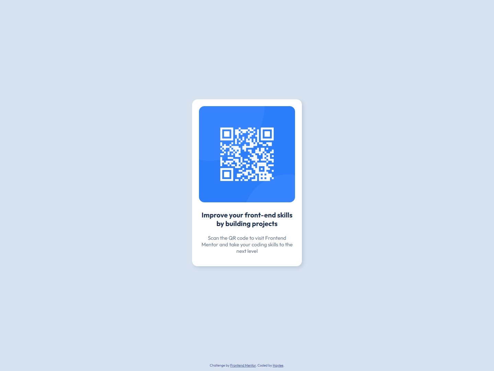

# QR Code Component 🚀

## Overview
This is a simple card with a QR code displayed

### Built With
🔴 Semantic HTML

🔴 CSS Custom Properties

🔴 CSS Flex

### Preview

  

    <b>Mobile Design:</b>
  

  

     
  

  

    <b>Desktop Design</b>
  

  

     
  

